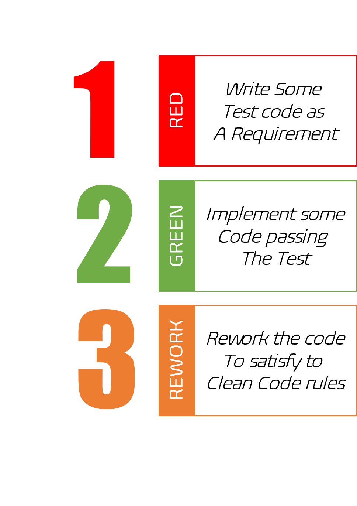

[ "McGivrer SkyLine 2023 edition")](https://skyline.github.com/mcgivrer/2023 "Go and see the dynamic skyline for 2023")

# McGivrer's place

## Who Am I?

Hello dear visitor. Welcome to my virtual software home.

I am a former software developer, now acting as a platform architect in a world-sized pharmaceutical life science industry (but this is top secret and I won't tell you because I would have to make you "disappear" :) 

Anyway, here is my playground around java (but not only !) software development, but you will also find some results from my research about software architecture usage, pattern, tooling and libraries usages.
My center of interest is any tool/software that can drive better and well-managed software, from ideation to production. 

I will try and use some [TDD](https://en.wikipedia.org/wiki/Test-driven_development "Go to the TDD Wikipedia description") approach, maybe [BDD](https://en.wikipedia.org/wiki/Behavior-driven_development "Go to the BDD Wikipedia description"), but moreover, [good documentation practices](https://www.writethedocs.org/guide/ "Write the docs !") (only personal point of view and experiment) and build automation with cloud offered platform like the GitHub one. 

## McG's devlog

- **2024-06-11** update of the build script now in the [5.2 version](https://gist.github.com/mcgivrer/3fe8a25a2815bca3a1a7f333f6944665 "go and test it !") adding more control on build steps and manage JAR dependencies. It adds a code quality check with CheckStyle with 2 default sets of code rules (choose between Sun or Google rules), the Javadoc now embeds the README.md file as an overview file.  
- **LATEST 2023-08-02** [Build scripts v4.2](https://gist.github.com/mcgivrer/a31510019029eba73edf5721a93c3dec "go and use the latest build scripts 4.2") is coming with some cool new features like JUnit test execution (thanks to [junit-platform-console-standalone](https://mvnrepository.com/artifact/org.junit.platform/junit-platform-console-standalone) library) at build time or just execute unit tests 'on-demand', and simplification of build script usage by adding a `build.properties` at the root path of the java project.
- **2022-05-20** [A v4.1 script to build light java project](https://gist.github.com/mcgivrer/a31510019029eba73edf5721a93c3dec#file-readme-md), having already the Javadoc generation and unit test execution thanks to the "JUnit platform console standalone".Now it can create an EPUB file from the /docs markdown documentation files, respecting a file and directory structure, and thanks to the fantastic tool [pandoc](https://pandoc.org "Let's have a try with pandoc !"),

> **WARNING** 
> This build script does not intend to replace a more efficient and useful [maven](https://maven.apache.org/ "don't you already know maven ?  time to discover the most industrial way to build java project") or [gradle](https://gradle.org "the latest but not least build tool for java ecosystem, supporting the Android ecosystem and more !") tool. 
> Its purpose is only to provide a fast way and ease of usage to build ridiculous small Java projects.
> But without sacrificing build features.

- [A standard all included Maven JAR project](https://gist.github.com/mcgivrer/d0b44b343b60196ce9cfde75963eac99 "Just start Jar project with that pom.xml")
- [My own Git Survival guide](https://gist.github.com/mcgivrer/81f67eddf93b0a9d46cac5f1ff4e45c6#file-git-survival-guide-md),
- [Git Bash as IntelliJ default Terminal](https://gist.github.com/mcgivrer/2b9917230588f3987d6acd4750ecf5c9#file-intellij-trick-and-tips-md "GitBash as terminal"),
- [Powerline and tmux on Ubuntu](https://gist.github.com/mcgivrer/63415530034a2a6f4cc968862c3d9e9d "see the magic recipe")
- [JDK and Docker Tools](https://gist.github.com/mcgivrer/247a302c67b8542f3e67b6de831ec83c#file-jdk-java-tools-usage-md)
- [Basic Java Survivor guide](https://gist.github.com/mcgivrer/e4e12e5701c18678e2340725d519cea6#file-basic-java-survivor-guide-md)

## Projects

- **[FromClassToGame](https://github.com/mcgivrer/fromClassToGame)** _&lt;Work In Progress&gt;_ 
A Work in progress [java game dev guide](https://github.com/mcgivrer/fromClassToGame/blob/main/docs/index.md) starting from a simple Java class and going step by step to a game framework implementation.
You Can contribute to the development through the [good first issues](https://github.com/mcgivrer/fromClassToGame/contribute).

## Statistics

